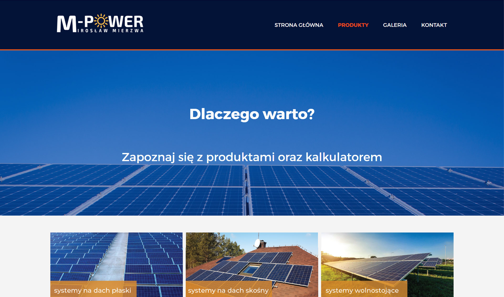
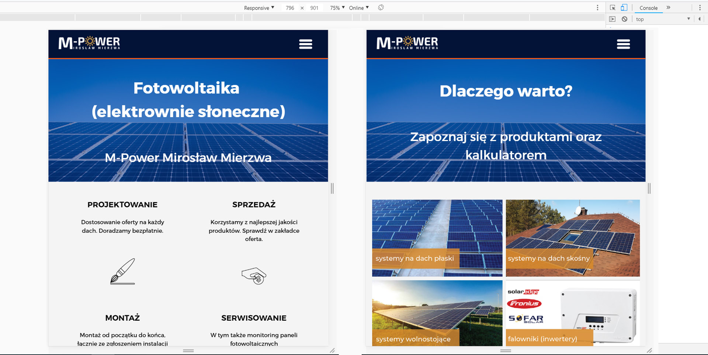
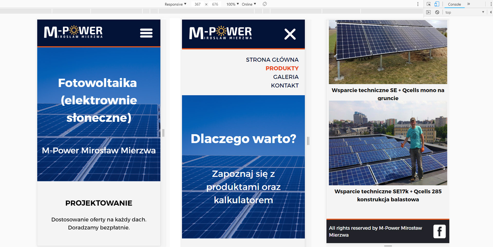

# Commercial project 1 - Renewable energy provider
> Website created for the local renewable energy provider. Live site [available here](http://www.m-power-fotowoltaika.pl), github pages demo [available here](https://karbudzik.github.io/Commercial-website-1-Renewable-energy-provider/galeria.html).

## Screenshots
### Desktop version:

### Tablet version:

### Mobile version:

## Technologies
* HTML5
* CSS
* JavaScript

## Remarks
The website is based on the very simple structure. I'm aware the CSS code could have been more elegant and I'm missing some SEO elements. However, the goal here was to have fully rosponsive website with as little time spent on creating it as possible.
